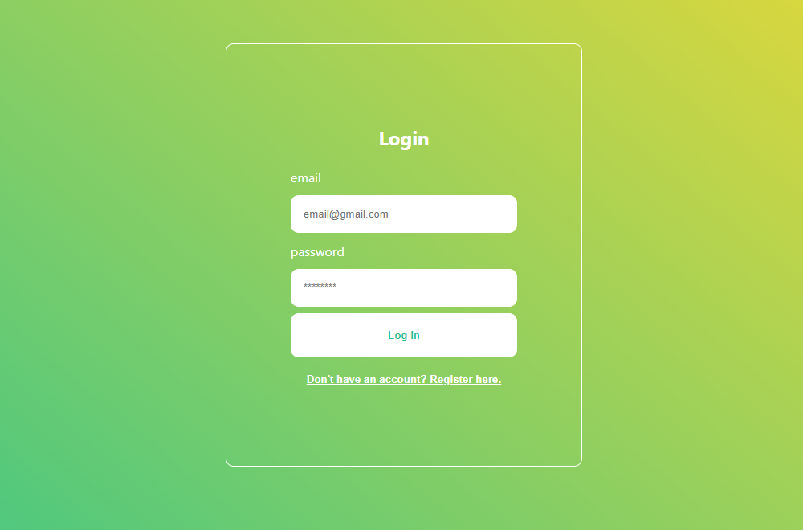
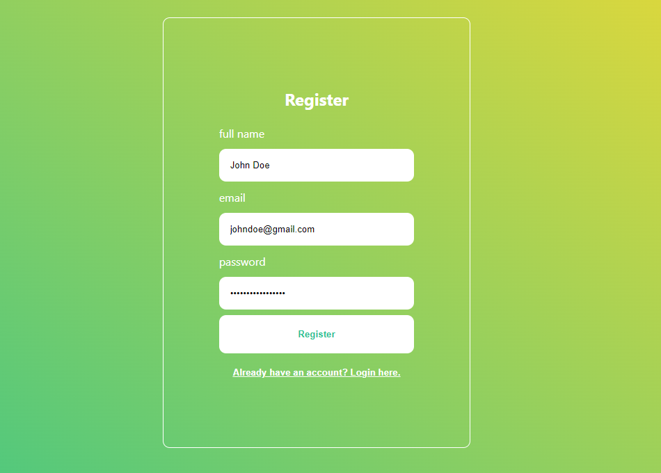

# Login-Register-Form with React

------------

[Deployed App](https://login-register-app-react.netlify.app "Deployed App")

[https://login-register-app-react.netlify.app](https://login-register-app-react.netlify.app)

------------

## Technologies
- React
- React-router-dom
- Redux Toolkit
- Firebase

------------

## Getting Started with Create React App

This project was bootstrapped with [Create React App](https://github.com/facebook/create-react-app).

------------

## Available Scripts

In the project directory, you can run:

### `npm start`